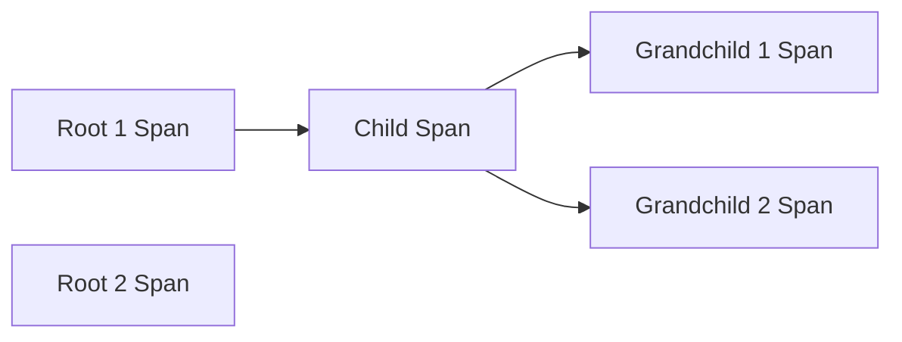

# Attach Detach Context Example

This example demonstrates context propagation using the attach/detach context APIs.

The example produces two traces represented by the following diagram:

```mermaid
flowchart LR
  r1[Root 1 Span] --> c[Child Span]
  c --> g1[Grandchild 1 Span]
  c --> g2[Grandchild 2 Span]
  r2[Root 2 Span]
```
