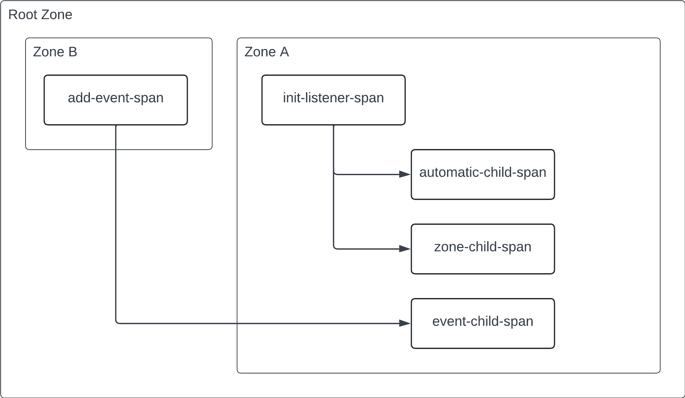

# Stream Context Propagation Example

This example demonstrates context propagation over a `Stream` or `StreamController`.

The example produces two traces represented by the following diagram:

Note: Because the current Zone when registering a listener is made current for any invocation of the listener, automatic context propagation using zones may lead to traces with long durations because the same parent context is used for any child span created within the listener callback.
