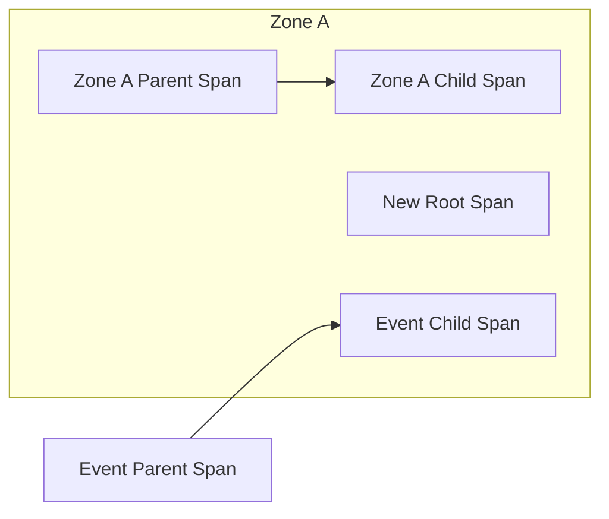

# Stream Context Propagation Example

This example demonstrates context propagation over a `Stream` or `StreamController`.

The example produces three traces represented by the following diagram:

Note: When registering a stream listener, A stream listener callback is executed in the Zone where the callback was registered. This can lead to long running traces if the stream gets an event long after it was registered. To avoid this issue, the `trace` and `traceSync` functions will attach and detach the span they create before and after invoking the callback given to them.
